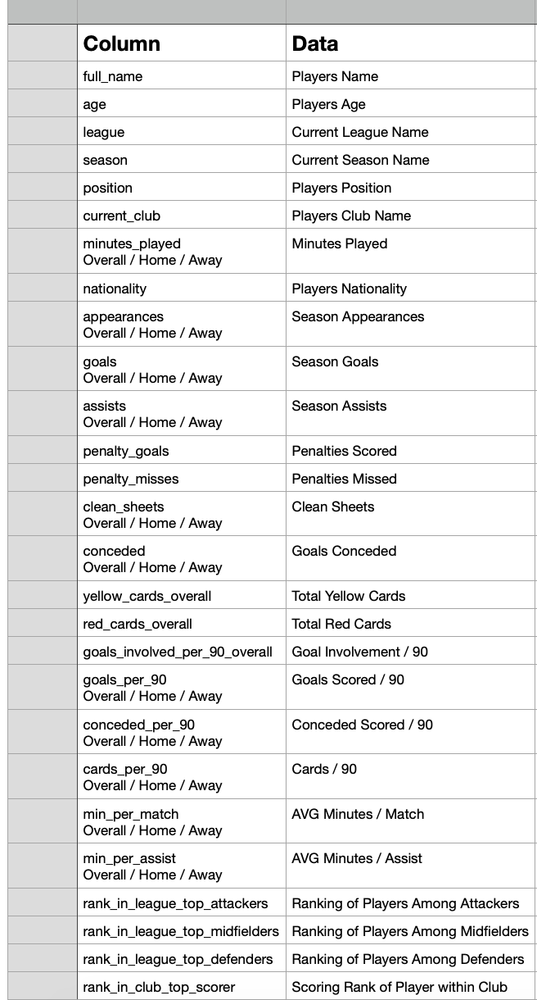
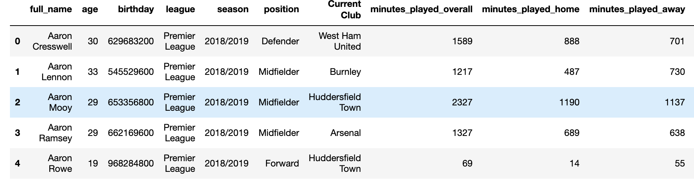
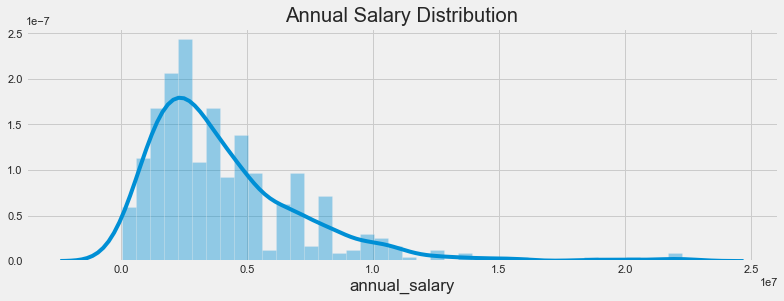
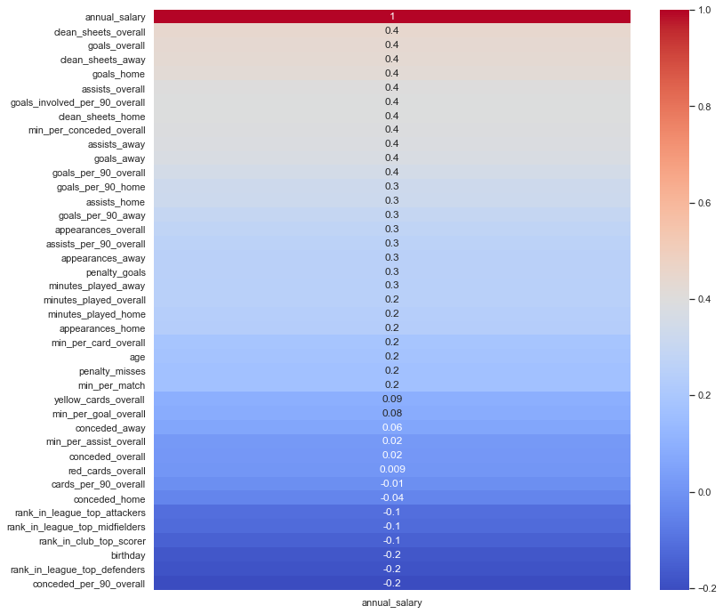
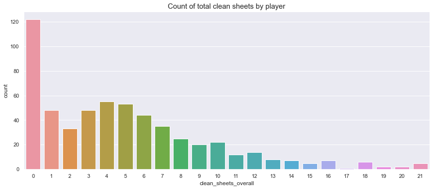
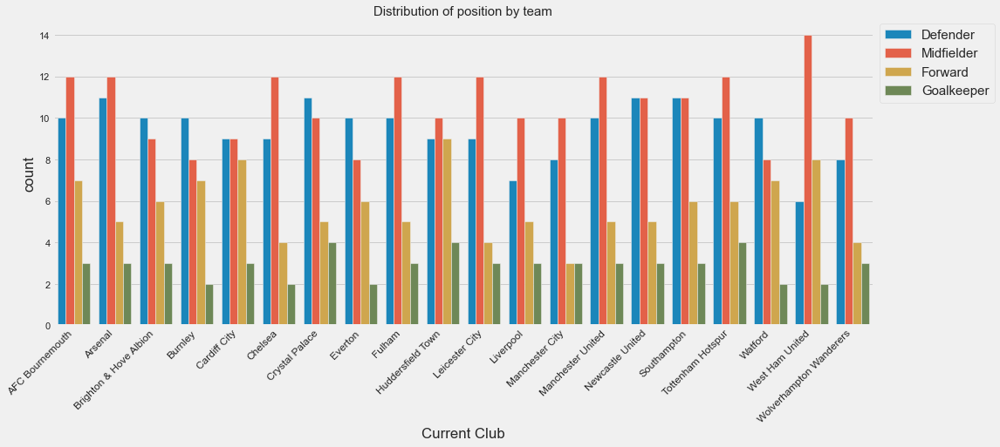
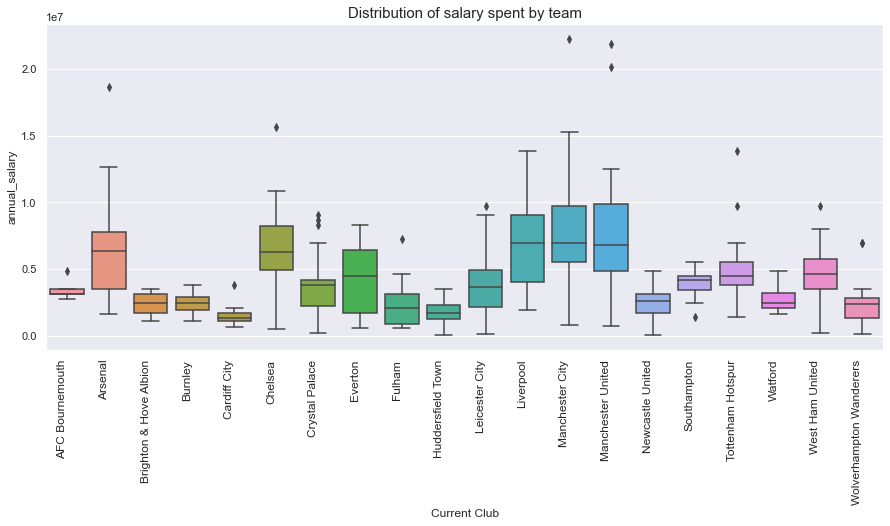

# Predicting 2018-2019 EPL Player Salaries Using Neural Networks

## Dataset Overview
* We will be using a 2018-2019 English Premier League Players Dataset provided by https://footystats.org/download-stats-csv#whats_included
* The original dataset did not include any annual salary feature, so additional 2018-2019 salary data from was web scraped and joined to the existing dataframe to get a complete dataset https://www.spotrac.com/epl/rankings/2018/
* The label: annual_salary
* The original annual salary was in pounds so to make it easier to comprehend we will convert the amount to US dollars based on the average exchange rate in 2018. 1.3349 USD https://www.exchangerates.org.uk
* The datasets are both cleaned and stored in the folder CleanData listed above 

## Data Description

## Data Sample

## More Info
Listed above are folders that include various items: 
* The RawData folder includes the raw data for the players dataset and the salary dataset. 
* The CleanData folder includes the clean datasets for the players concatenated with salary dataset and the non top 4% in salary dataset. 
* The plots folder includes the Exploratory Data Analysis Visualizations and some will be listed below. 
* Lastly the notebook folder includes the jupyter notebook with all of the code to run for yourself. Enjoy!

# Exploratory Data Analysis

To gain greater insight into our label annual_salary, here is the distribution: 

As we can see most players are paid $5 million and less

Now let's see which features have mild, strong, or no correlation with annual salary

We can see that most features have a positive effect on a player's salary with factors such as goals_overall and clean_sheets_overall leading the way.

Let's take a look at the clean_sheets_overall feature and see where most players

Most players never achieved a clean sheet throughout the season, while some players obtained 20 or more clean sheets.

Let's delve deeper and look at leaguewide in respect to which teams carry a certain amount of each position

We can see that most teams carry about the same number of each position

Most notably teams spend a certain amount on their players, so here is a disribution of salary spent by team

We right away can see the big five in Arsenal, Chelsea, Liverpool, Man City, and Man United. While on the other hand the newly promoted teams don't even have a budget close to the big spenders. It is worthy to note that the club that spent the most was Man City and they won the title. 

# Neural Network (Regression)

A train test split with a test size of 0.3 was performed on the data. The data was then scaled and normalized to ensure that all the data was in the same range. A Sequential model was then created with a Dense input layer of 62 neurons and three other hidden layers of 31,16,and 8 neurons. The activation function that was performed was a rectified linear unit('relu'). Lastly, the model was compiled using a 'adam' optimizer and a loss of 'mean squared error'. In our three runs when we used early stopping and the non_top_4_pct data we achieved the lowest mse and best val_loss and loss relationship. The best model ran at 535 epochs and here are some visuals to highlight the results.

